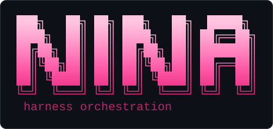
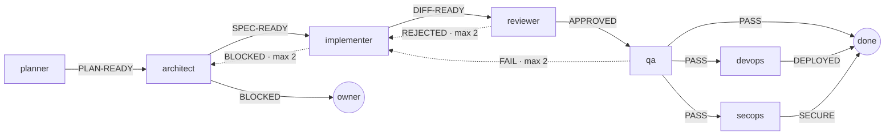
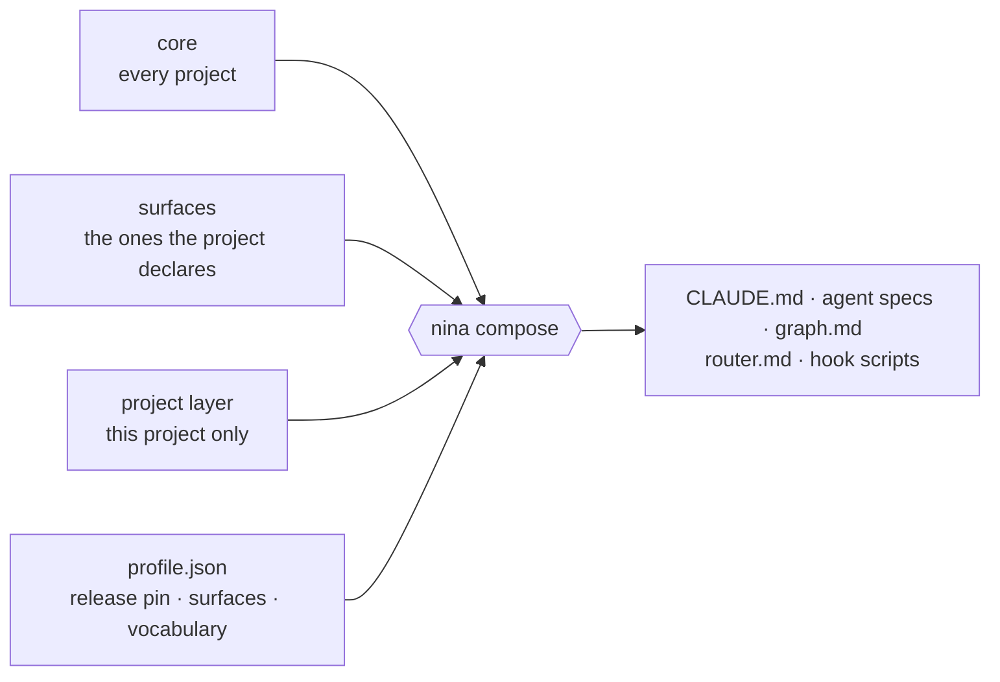
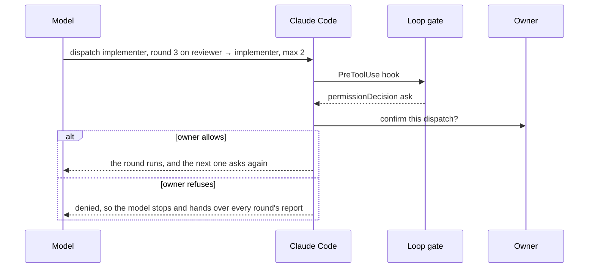
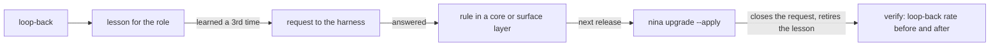

<p align="center">
  
</p>

NINA is a command-line compiler for the multi-agent pipeline I run inside Claude Code. It composes that
pipeline into each project from versioned layers, and it uses hooks to enforce the rules a prompt can only ask
for. It reads Claude Code's own transcripts to measure what the pipeline did. When the pipeline keeps making
the same mistake, NINA turns the lesson into a rule in the next release.

## At a glance

- Projects don't copy the harness anymore. Each one pins a frozen release and composes from it. `nina upgrade`
  moves it forward, checks the result with the project's own detectors, and undoes the move if a check fails.
- The pipeline is declared as a graph of stages, verdicts and edges, and it's validated on every check. Every
  loop-back edge has a cap.
- Hooks count the rounds of each loop. When a dispatch would go past a cap, Claude Code asks the owner first,
  even in auto mode.
- The numbers come from transcripts. That's how I found a "mandatory" rule that had been followed 2 times in
  743 runs, and a loop counter whose cap fired 8 times when only one of those was a real repeat.
- A lesson the pipeline learns three times becomes a request to the harness. The answer ships as a rule in a
  release, and the upgrade that installs it closes the request.

## Why

My agent harness (the `CLAUDE.md`, the subagent specs, the routing rules) used to move between projects by
copy-paste, and each copy started drifting the day it was made. I'd fix a rule in one project and it stayed
broken in the others. After a while I couldn't tell which copy was current. NINA turns the harness into
something a project composes and pins.

I built it one rung at a time, and every rung ended up as working code:

| Rung | In NINA |
|---|---|
| Prompts | rules written once, split into layers: core, surfaces, project |
| Harness | the layers composed into a project and pinned to a frozen release |
| Loops | stages that send work back, with a cap on every loop that hooks enforce |
| Graphs | the pipeline declared once as data, and validated on every check |
| Self-improving system | lessons that graduate into rules, with their effect measured |

## The pipeline it composes

There are eleven subagents, and a project gets the ones its risks call for. Every project gets `planner`,
`architect`, `implementer`, `reviewer`, `qa`, `devops` and `secops`. A database adds `dba`, external services
add `integration-tester`, and smart contracts add `solidity-dev` and `solidity-auditor`, since contract code
can't be patched once it ships. The chain also scales with the change. A one-file label fix gets a light chain
or a direct edit, and anything on a critical path (auth, plus what the project's surfaces add: money, the database, an
integration) goes through every
gate.



<sub>Simplified. The core graph has 22 edges, 11 of them capped loop-backs (the dotted ones), and each surface
adds its own stage and edges.</sub>

In a project, the graph lives in one file with one edge per line, and `nina check` validates it:

```text
- `reviewer` → `implementer` on `REJECTED` — an implementation bug · max 2
- `reviewer` → `architect` on `REJECTED` — a design flaw, or no preview-deploy plan · max 2
```

Every stage needs a spec and every spec needs to be a stage. An edge has to leave on a verdict its stage can
actually emit, every verdict has to go somewhere, and every loop-back needs a cap. A spec's prose can only
mention a route the graph has.

## How it works

### Composition from layers

| Layer | Holds |
|---|---|
| core | what's true for every project |
| surface | what's true for projects that have it: `db`, `money`, `integrations`, `frontend`, `pii`, `edge-cf`, `blockchain` |
| project | what's true for one project only, kept in that project's repo |

Each layer mirrors the project's file tree, and `nina compose` merges them:

- `<!-- nina:slot db.1 -->` in a core file is a hole the `db` surface fills. A project with no database drops
  the slot, so its agents never read a word about Prisma.
- `<!-- nina:requires db -->` on a file's first line makes the whole file conditional. That's why a
  frontend-only project gets seven agent specs instead of eleven.
- `{{PLACEHOLDERS}}` get filled from the project's profile, so the core can state a rule without naming one
  project's provider, packages or models. A release can answer a name itself, like the typecheck and test
  commands, and a project declares it only to change it.
- Every composed file opens with a notice naming the layer to edit instead. Claude Code's `Edit` tool refuses
  a file the agent hasn't read, so any agent editing an existing file sees the notice first. Seeing it isn't
  the same as obeying it, so an edit guard hook refuses the edit and quotes the notice back.



Composition gets tested like code. Four fixture projects, one for each shape worth testing, have to pass ten
properties each: no placeholder survives, every unfilled slot belongs to the project, nothing leaks in from a
surface the project didn't declare, gated files show up exactly when they should, rule references resolve,
the notice never lands above a frontmatter block, every agent spec declares its tool allowlist, the graph
validates, every numbered list counts 1, 2, 3 in every profile, and every file fits a size budget. An eleventh check looks at the layers themselves: a surface's technology, role or domain may only be named in
files gated on that surface. The first time it ran, it found 37 places where ungated core prose handed work
to a role that only some projects have.

### Releases and upgrades

A release freezes the core and the surfaces, and a frozen release is never rewritten. Each project pins one in
`.nina/profile.json`, so I can keep changing the harness without moving a project that's shipping.

`nina upgrade --to <version>` starts with a report of what the move would cost. The real risk is text the
project wrote that the new core has no place for, and the command won't apply while any of it would lose its
meaning. `--apply` runs the whole move and then checks it with the project's own detectors:

```text
  pinned 0.13.0
  ✓  composing the harness files — 17 file(s)
  ✓  checking the declaration — check: declaration is sound
  ✓  validating the pills — pills: all 13 well formed
  ✓  running the project's own detectors — harness: current (4 detectors clean)

  upgrade: 0.7.0 → 0.13.0 applied and verified.
```

If a step fails, the project goes back byte for byte, including the old pin, the old composition and the
owner's own edits. Every step also runs before the move, so a problem the project already had gets reported as
pre-existing instead of blamed on the upgrade.

Three things recorded in the project's own repo fully determine its harness: the NINA version in its lockfile,
the release pin and the project layer.

### Loop caps that hold

A cap written as an instruction only works if the model counts its own rounds, so NINA's loop gate counts them
instead. Claude Code hooks keep a small ledger for each session, with metadata only: which stage reported which
verdict and the short ids it gave the issues it sent back, which dispatch went out and when, and when the owner
last spoke. On `PreToolUse`, if a dispatch would
go past a cap, the gate answers `permissionDecision: "ask"` and Claude Code puts the dispatch in front of the
owner. Before relying on it, I checked that this also works in auto mode.



It asks instead of denying because it can't be sure two rounds are about the same issue. The stages now name
their issues, but a model can rename one between rounds, so a wrong count should still cost one click.

I worked out what counts as a round by replaying six weeks of a real project's history. The obvious rule was to
count a dispatch to an edge's target after a loop-back from its source. It hit a cap 8 times, and 7 of those
were different issues that happened to travel the same edge. The rules that replaced it:

- a round is a dispatch that acts on a declared loop-back;
- parallel dispatches acting on the same verdicts count as one round;
- a pass cancels a rejection only if a fix went out in between;
- when the owner speaks, every count starts over;
- while every report in a loop names its issues, each issue gets its own count, and the edge still asks once it
  goes past twice its cap, in case an issue was renamed along the way. One report that names nothing puts the rest of
  that loop back on the edge's count.

Three separate reviews each found a case the counting still got wrong before it shipped.

Probing the live system changed the design twice. `UserPromptSubmit` fires when a subagent's report is
delivered, and not only when a person types. Resetting on every prompt would have wiped every count, so only
human prompts reset. The gate also never reads the session transcript to decide anything. Claude Code writes
that file asynchronously, and a resumed session rewrites its own history. In one 385 MB transcript, 74% was
replay.

The gate fails open and logs its errors. Every project runs a self-test among its detectors. It pushes a whole
loop through the project's own hook command and expects the round past the cap, and only that round, to reach
the owner.

### Findings that reach the model

Each project runs NINA's detectors from two hooks, and each hook reaches a different reader:

| Hook | Reaches |
|---|---|
| `Stop` | the person, with what the turn left behind |
| `UserPromptSubmit` | the model, as `additionalContext`, before it answers |

For a long time only the first one existed, so every finding went to the person, who wasn't the one about to
act on it. The detectors report drift in the composed files, what a new project still has to declare (so its
first conversation starts by filling that in without being asked), lessons that are owed, and the health of the
loop gate itself.

### Measurement and the learning cycle

`nina snapshot` reads Claude Code's transcripts and records each dispatch: which stage ran, the verdict it
declared, whether it got sent back, which skills it used and whether it read its lessons. The store keeps
metadata only. Report text, source code and personal data never go in.

`nina export --langfuse` sends the same history to Langfuse: each session a trace, each dispatch an
observation with its tokens and estimated cost, each verdict a score. It sends less than the store holds, and
each run exactly once, after it has settled, because Langfuse keeps what it is first sent and a second send
of the same run would count twice.

When a stage gets sent back, the pipeline can write a lesson for that role. `nina learn` checks the cycle one
link at a time, and its first audit found four of the five links broken. Here's the same project before and
after I redesigned it:

```text
  observe   826 dispatch(es) recorded, 2026-08-12 → 2026-09-22
  capture   ✗ reviewer: 24 loop-back(s) since its newest lesson (2026-09-03)
  apply     592 of 646 run(s) of roles that have lessons opened their pills (92%)
  graduate  0 lesson(s) at 3+ occurrences · 0 request(s) open
  verify    reviewer/…-never-write-to-repo-files.md (2026-09-03): 2% → 29% loop-back (n 43 → 104)
```

```text
  observe   826 dispatch(es) recorded, 2026-08-12 → 2026-09-22
  capture   ✓ no role has looped back 3+ times without a lesson in the last 14 days
  apply     581 of 720 run(s) of roles that have lessons read one (81%); 81 only listed the directory — measured since 2026-08-12. Reading is not obeying; nothing here can see that.
  graduate  3 lesson(s) at 3+ occurrences · 0 request(s) open
            → nina learn --graduate .claude/pills/integration-tester/regenerate-the-premise-index-after-editing-an-integration-doc.md
            → nina learn --graduate .claude/pills/qa/exit-code-is-the-verdict.md
            → nina learn --graduate .claude/pills/shared/test-must-name-the-mutation-that-fails-it.md
  verify    qa/vitest-file-filter-needs-no-double-dash.md (2026-09-01): 8% → 19% loop-back (n 13 → 79); every other role 17% → 20%
            reviewer/reviewer-never-write-to-repo-files.md (2026-09-03): 2% → 29% loop-back (n 43 → 104); every other role 22% → 16%
```



A lesson learned for the third time now gets filed automatically, as a request against the pinned version. A
project can't edit the harness. It can only ask. I answer requests in the harness repo, into a file the next
release freezes, and the upgrade that installs the answer closes the request and retires the lesson. The first
full cycle has already happened: the three lessons in the second output became harness rules in 0.20.0, and the
upgrade closed all three requests by itself.

Counting loop-backs doesn't say what they were about. `nina learn --deep` reads each loop-back's report and has
a small model, on the same login, group them by cause and set the causes against the lessons already written.
It proposes a lesson for each recurring cause that none covers, and it writes nothing itself. The first run,
over one project's 70 loop-backs, took six calls and proposed five lessons nobody had written.

### Evaluating a release

A loop-back rate moves with the work as much as with the rules, so it can't show whether a rule change helped.
`nina eval` runs an experiment instead. The reviewer each release composes reviews the same change, which
carries twelve planted defects, and the report counts what each one caught. It runs `claude -p` on the
Claude Code login, so it uses the subscription and never a per-token key, and the grading is deterministic.
The first run caught 11 of 12, and it also showed the reviewer writing a sentence before its verdict line,
which the gate would have read as no verdict at all. An optional judge, a second model on the same login,
reads each report for what line numbers can't show, and has to quote the report for every defect it says
was found. It found the twelfth defect described in words. It's also asked to call each other finding real or
noise, and before any of that it judges a report that found nothing, which has to come out at zero.

## What measuring found

None of this showed up until I counted.

- Mandatory skills were invoked 2 times in 743 subagent runs. `Skill` was missing from every role's `tools:`
  allowlist, so the rule could never run. The prose looked fine for three months.
- Lessons were captured at 3% of the rate the rules asked for, 2 lessons from 78 loop-backs. "Write a lesson on
  every loop-back" had trained everyone to skip them. The rule is now "ask whether this would happen again", and
  the detector fires on an event instead of watching a rate.
- A metric for "agents apply their lessons" said 92%, because listing a directory counted as reading. Counting
  only real reads, it's 81%. Even that only measures reading. Nothing in a transcript shows whether an agent
  obeyed.
- The first before/after readings went up after their lessons, with every other role as a control. Maybe the
  reviewer got better at catching things, or maybe the lesson didn't help. It isn't proof, but without the
  numbers I couldn't even ask.

## Getting started

You need Node 20 or newer. NINA has no dependencies, and a project installs it straight from this repo:

```bash
pnpm add -D github:xhulz/nina
npx nina init
```

`init` works out the surfaces a repo reveals (a Prisma schema means `db`, a wrangler config means `edge-cf`) and
asks about the ones no file can settle. It writes `.nina/profile.json`, wires the Claude Code hooks and composes
the harness. The first Claude Code session in the project then starts by filling in whatever is still missing.

The test suites run from this repo:

```bash
node scripts/compose-test.mjs     # the fixtures against their properties, plus the layer audit
node scripts/cli-test.mjs         # the CLI end to end, in scratch projects
```

## Repository map

| Path | What's there |
|---|---|
| [`bin/nina.mjs`](bin/nina.mjs) | entry point and command table |
| [`src/commands/`](src/commands) | one file per command |
| [`src/graph.mjs`](src/graph.mjs) | parses and validates a composed pipeline graph |
| [`src/gate.mjs`](src/gate.mjs) | the loop gate: the ledger, what counts as a round, one answer per hook event |
| [`src/wiring.mjs`](src/wiring.mjs) | the hooks and npm scripts a project needs, read by `init`, `wire`, `check` and `upgrade` |
| [`src/transcripts.mjs`](src/transcripts.mjs) | the transcript parser |
| [`src/detectors.mjs`](src/detectors.mjs) | runs a project's detectors from its hooks |
| [`core/`](core), [`surfaces/`](surfaces) | the harness layers |
| [`releases/`](releases) | the frozen releases projects pin |
| [`fixtures/`](fixtures) | projects that exist to be composed and checked |
| [`evals/`](evals) | a change with planted defects, for comparing one release's reviewer with another's |
| [`scripts/`](scripts) | the test suites and this repo's own checks |
| [`docs/`](docs) | every mechanism, and why it ended up the way it did |

[`docs/`](docs) is the long version. [`CLAUDE.md`](CLAUDE.md) is the short one Claude Code reads when it works on
this repo, with a table of which document to read before changing what.

## Engineering

- Node.js with zero runtime dependencies. About 6.5k lines of source and 2.8k lines of tests.
- 38 frozen releases so far. The package ships all of them, so an upgrade can compose its target and report the
  cost before it changes anything.
- The tests check properties over the fixture projects, audit the layers, run the whole CLI in scratch projects,
  and use mutation checks for the rules that matter: undo the rule and some test has to fail.
- Known limits are written down. The loop gate can't see a fix the model makes by itself without a subagent, for
  example, and a scheduled `/loop` prompt resets the counts the same way a person's reply does.
- Commands: `init`, `compose`, `check`, `where`, `pills`, `learn`, `requests`, `wire`, `gate`, `upgrade`,
  `release`, `snapshot`, `stats`, `eval`, `export`.

<sub>© 2026 Marcos Schulz. All rights reserved. The source is public so it can be read, and forking it on GitHub
is fine, but no license to use, copy, modify or distribute it is granted. See [LICENSE](LICENSE).</sub>
