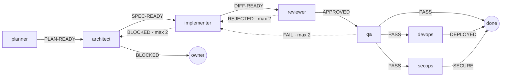
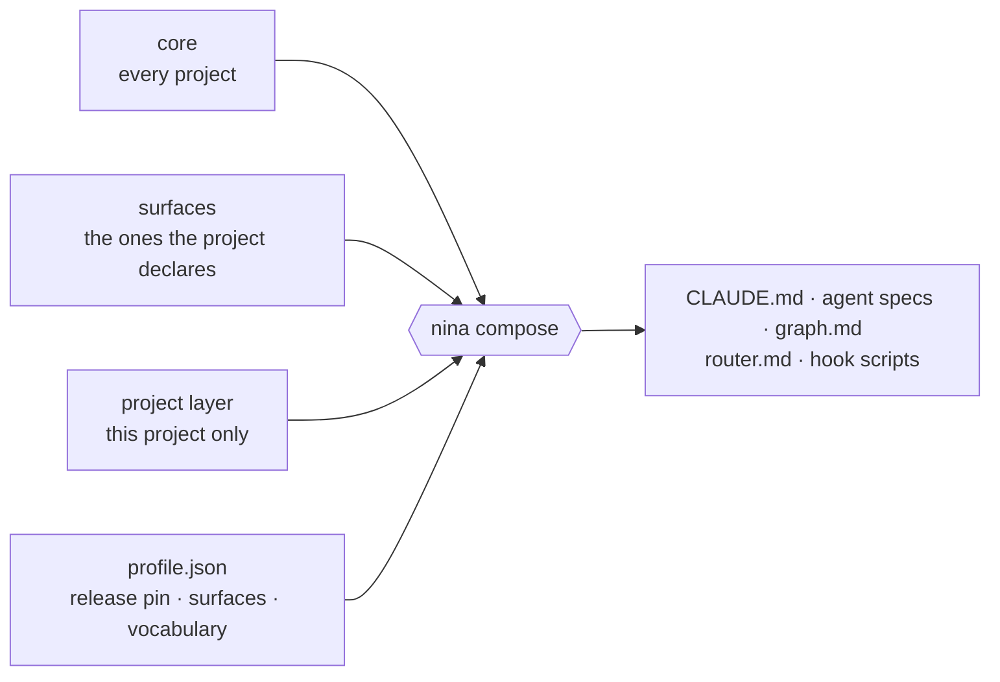
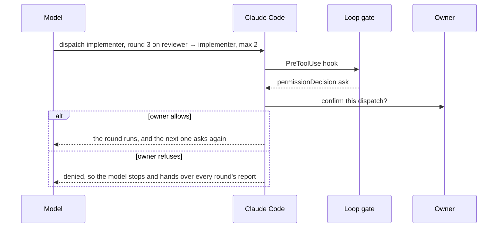
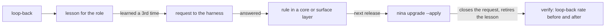

```text
 ███╗   ██╗ ██╗ ███╗   ██╗  █████╗
 ████╗  ██║ ██║ ████╗  ██║ ██╔══██╗
 ██╔██╗ ██║ ██║ ██╔██╗ ██║ ███████║
 ██║╚██╗██║ ██║ ██║╚██╗██║ ██╔══██║
 ██║ ╚████║ ██║ ██║ ╚████║ ██║  ██║
 ╚═╝  ╚═══╝ ╚═╝ ╚═╝  ╚═══╝ ╚═╝  ╚═╝
  harness orchestration
```

# NINA

**Harness orchestration for Claude Code.** NINA is a command-line compiler for the multi-agent pipeline I
run inside Claude Code. It composes that pipeline into each project from versioned layers, holds the limits
that prose alone can't, measures what the pipeline actually did from Claude Code's own transcripts, and turns
a mistake the pipeline keeps making into a rule in the next release.

> [!NOTE]
> This repository is the write-up — the source is private. NINA is a personal project in daily use on a real
> codebase, and I'm happy to walk through the code on request.

## At a glance

- **One harness, many projects, no copies.** Each project pins a frozen release and composes from it.
  `nina upgrade` moves it forward, verifies the move with the project's own checks, and puts everything back
  if one fails.
- **The pipeline is a graph, not prose.** Stages, verdicts and edges are declared once and validated; every
  loop-back carries a cap.
- **Caps that hold.** Claude Code hooks count the rounds, and the round past a cap waits for the owner to
  confirm it — in auto mode too.
- **Measured, not assumed.** Reading the transcripts showed a "mandatory" rule followed 2 times in 743 runs,
  and a naive loop counter whose cap fired 8 times — 7 of them on different issues.
- **It learns.** A lesson learned three times is filed as a request to the harness, answered as a rule in a
  release, and closed by the upgrade that installs it.

## Why

My agent harness — `CLAUDE.md`, the subagent specs, the routing rules — used to travel between projects by
copy-paste, and every copy drifted from the moment it was made. A rule fixed in one project stayed broken in
the others, and nobody could tell which copy was current. NINA makes the harness something you compose and
pin, instead of something you copy.

It grew up one ladder, and each rung is a working mechanism:

| Rung | In NINA |
|---|---|
| **Prompts** | rules written once, in layers: core, surfaces, project |
| **Harness** | the layers composed into a project, pinned to a frozen release |
| **Loops** | stages that send work back — every loop capped, the caps held by hooks |
| **Graphs** | the pipeline declared once, as data, and validated on every check |
| **Self-improving system** | lessons that graduate into rules, with their effect measured |

## The pipeline it composes

Eleven specialized subagents, gated by risk. Every project gets `planner`, `architect`, `implementer`,
`reviewer`, `qa`, `devops` and `secops`; `dba` comes with a database, `integration-tester` with external
services, and `solidity-dev` and `solidity-auditor` with contracts that ship immutable. The chain is
proportional: a one-file label change takes a light chain or a direct edit, while money, database, auth and
integration changes are always fully gated.



<sub>Simplified. The core graph has 22 edges, 11 of them capped loop-backs (dotted), and each surface adds
its own stage and edges.</sub>

In the project, that graph is one file, one edge per line, and `nina check` validates it:

```text
- `reviewer` → `implementer` on `REJECTED` — an implementation bug · max 2
- `reviewer` → `architect` on `REJECTED` — a design flaw, or no preview-deploy plan · max 2
```

Every stage has a spec and every spec is a stage; every edge leaves on a verdict its stage can actually emit;
every verdict goes somewhere; every loop-back has a cap; and no spec's prose names a route the graph doesn't
have.

## How it works

### Composition from layers

| Layer | Holds |
|---|---|
| **core** | what is true for every project |
| **surface** | what is true for projects that have one: `db`, `money`, `integrations`, `frontend`, `pii`, `edge-cf`, `blockchain` |
| **project** | what is true for one project only — kept in that project's own repository |

Each layer mirrors the project's tree, and `nina compose` joins them:

- **Slots.** `<!-- nina:slot db.1 -->` in a core file is a hole the `db` surface fills. A project with no
  database drops it, and never reads a word about Prisma.
- **Gated files.** `<!-- nina:requires db -->` makes a whole file conditional — which is why a frontend-only
  project gets seven agent specs, not eleven.
- **Vocabulary.** `{{PLACEHOLDERS}}` filled from the project's profile let the core state a rule without
  naming one project's provider, packages or models.
- **A generated notice.** Every composed file names the layer to edit instead. Claude Code's `Edit` refuses
  a file the agent hasn't read, so the notice reaches every edit of an existing file.



Composition is checked, not trusted. Four fixture projects — one per shape worth testing — must each hold
eight properties: no placeholder survives, every unfilled slot is the project's own, nothing leaks from a
surface the project didn't declare, gated files appear exactly when they should, rule references resolve,
the notice never lands above a frontmatter, every agent spec declares its tool allowlist, and the graph
validates. A ninth check audits the layers themselves: a surface's technology or role may only be named in
files gated on that surface. The first time it ran, it found 37 places where ungated core prose sent work to
a role only some projects have.

### Releases and upgrades

A release freezes the core and surfaces, and releases are never rewritten. A project pins one in
`.nina/profile.json`, so work on the harness never moves a project that is shipping.

`nina upgrade --to <version>` first reports what the move would cost — text the project wrote that the new
core has nowhere to put — and refuses to apply while anything would lose meaning. `--apply` runs the whole
move, then verifies it with the project's own detectors:

```text
  pinned 0.13.0
  ✓  composing the harness files — 17 file(s)
  ✓  checking the declaration — check: declaration is sound
  ✓  validating the pills — pills: all 13 well formed
  ✓  running the project's own detectors — harness: current (4 detectors clean)

  upgrade: 0.7.0 → 0.13.0 applied and verified.
```

A step that fails puts the project back byte for byte: the old pin, the old composition, and the owner's own
edits. Every step is also measured before the move, so a problem the project already had is reported rather
than blamed on the upgrade.

NINA ships as a vendored tarball. A project's harness is fully determined by three things in its own
repository — the package version, the release pin and its project layer — so a fresh clone needs no
registry, no auth and no checkout of the harness.

### Loop caps that hold

A cap written as an instruction depends on the model counting its own rounds. NINA's **loop gate** counts
them instead. Claude Code hooks write a small ledger per session — metadata only: which stage reported which
verdict, which dispatch went out and when, and when the owner spoke. At `PreToolUse`, the gate answers the
dispatch that would go past a cap with `permissionDecision: "ask"`, so Claude Code puts it in front of the
owner. That this works in auto mode was probed, not assumed.



**Why ask instead of deny.** Whether two rounds are "the same issue" can't be seen with certainty from
outside the conversation, so a wrong count should cost one click, not a stopped pipeline.

**What counts as a round** came from replaying six weeks of a real project's history. The obvious rule — a
dispatch to an edge's target after a loop-back from its source — fired its cap 8 times, and 7 were different
issues on the same edge. What replaced it: a round is a dispatch that *acts on* a declared loop-back; parallel
dispatches acting on the same verdicts are one round; a pass cancels a rejection only if a fix went out in
between; and the owner speaking resets every count. Each of three independent reviews found a shape the
counting still got wrong before it shipped.

**Probing the live system shaped two decisions.** `UserPromptSubmit` fires when a subagent's report is
delivered, not only when a person types — resetting on every prompt would have emptied every count, so only
human prompts reset. And the gate never reads the session transcript to decide: Claude Code writes that file
asynchronously, and a resumed session rewrites its own history — 74% of one 385 MB transcript was replay.

The gate fails open and logs its errors. A self-test runs as a detector in every project, dry-running a whole
loop through the project's own hook command and expecting exactly the round past the cap to reach the owner.

### Findings the model actually reads

Each project runs NINA's detectors from two hooks, and they reach different readers:

| Hook | Reaches |
|---|---|
| `Stop` | the person — what the turn left behind |
| `UserPromptSubmit` | the model, as `additionalContext`, before it answers |

For a long time only the first existed, so every finding went to the one reader who wasn't about to act on
it. The detectors cover drift in the composed files; what a new project still has to declare, so its first
conversation starts by filling it in, unasked; lessons owed; and the loop gate's own health.

### Measurement and the learning cycle

`nina snapshot` reads Claude Code's transcripts and records every dispatch: which stage ran, what verdict it
declared, whether it was sent back, which skills it used, whether it read its lessons. The store holds
metadata only — no report text, no source, no PII.

When a stage is sent back, the pipeline can write a **lesson** for that role. `nina learn` asks, link by
link, whether the cycle is real. Its first audit found four of the five links open. The same project, before
and after the redesign:

```text
  observe   826 dispatch(es) recorded, 2026-08-12 → 2026-09-22
  capture   ✗ reviewer: 24 loop-back(s) since its newest lesson (2026-09-03)
  apply     592 of 646 run(s) of roles that have lessons opened their pills (92%)
  graduate  0 lesson(s) at 3+ occurrences · 0 request(s) open
  verify    reviewer/…-never-write-to-repo-files.md (2026-09-03): 2% → 29% loop-back (n 43 → 104)
```

```text
  observe   826 dispatch(es) recorded, 2026-08-12 → 2026-09-22
  capture   ✓ no role has looped back 3+ times without a lesson in the last 14 days
  apply     581 of 720 run(s) of roles that have lessons read one (81%); 81 only listed the directory — measured since 2026-08-12. Reading is not obeying; nothing here can see that.
  graduate  3 lesson(s) at 3+ occurrences · 0 request(s) open
            → nina learn --graduate .claude/pills/integration-tester/regenerate-the-premise-index-after-editing-an-integration-doc.md
            → nina learn --graduate .claude/pills/qa/exit-code-is-the-verdict.md
            → nina learn --graduate .claude/pills/shared/test-must-name-the-mutation-that-fails-it.md
  verify    qa/vitest-file-filter-needs-no-double-dash.md (2026-09-01): 8% → 19% loop-back (n 13 → 79); every other role 17% → 20%
            reviewer/reviewer-never-write-to-repo-files.md (2026-09-03): 2% → 29% loop-back (n 43 → 104); every other role 22% → 16%
```



A lesson learned a third time is now filed automatically, as a request against the pinned version — a
project can't edit the harness, only ask. The request is answered in the harness repository, into a file the
next release freezes, and the upgrade that installs the answer closes the request and retires the lesson.
The first full turn is done: the three lessons above became harness rules in 0.20.0, and the upgrade closed
all three requests on its own.

## What measuring found

Every rule the harness couldn't enforce stayed invisible until it was counted.

- **Mandatory skills were invoked 2 times in 743 subagent runs.** `Skill` was missing from every role's
  `tools:` allowlist, so the rule had never been executable. The prose looked right for three months.
- **Lesson capture ran at 3% of what the rules demanded** — 78 loop-backs, 2 lessons. "Write a lesson on
  every loop-back" had taught everyone to skip them. The rule became "ask whether it would happen again", and
  the detector now fires on an event rather than a rate.
- **"Agents apply their lessons" read 92%** while listing a directory counted as reading. Counting only real
  reads, it was 81% — and even that measures reading, not obeying.
- **The first before/after readings went *up* after their lessons**, with every other role as a control.
  That may mean a reviewer that catches more rather than one that learned less. It isn't proof — but without
  the measurement the question couldn't even be asked.

## Engineering

- **Node.js, zero runtime dependencies.** About 6.5k lines of source and 2.8k lines of tests.
- **33 frozen releases so far.** The package ships every one, so an upgrade can compose its target and report
  the cost before it moves anything.
- **Tests:** property checks over fixture projects, an audit of the layers, end-to-end CLI runs in scratch
  projects, and mutation checks for the rules that matter — undo the rule, and some test must fail.
- **Limits are written down, not hidden.** The loop gate can't see a fix the model makes without a subagent,
  for example, and a scheduled `/loop` prompt resets counts the way a person's reply does.
- **Commands:** `init` · `compose` · `check` · `where` · `pills` · `learn` · `requests` · `wire` · `gate` ·
  `upgrade` · `release` · `snapshot` · `stats`

## About

Built by [Marcos Schulz](https://github.com/xhulz) as a personal project — a way to learn by building every
rung, from prompts to a self-improving system. Built in pair with Claude Code: I set the direction and the
constraints and made the calls, and much of the code was written in those sessions.

<sub>© 2026 Marcos Schulz. All rights reserved. This repository contains documentation only; no license to
use NINA is granted.</sub>
